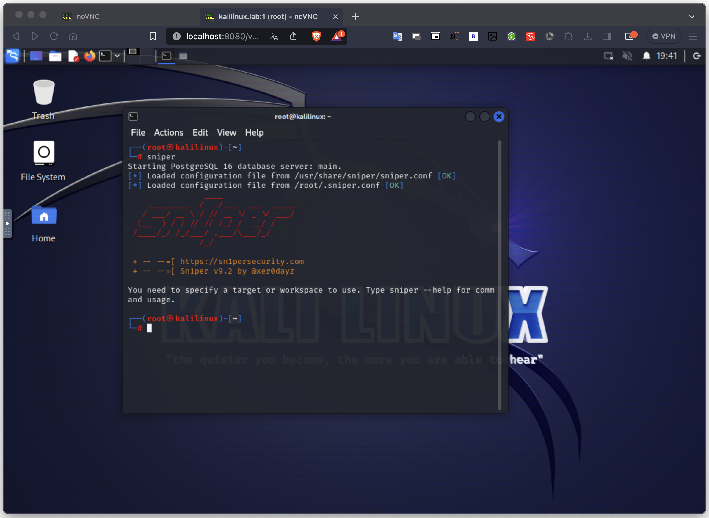

# Kali Linux desktop on the browser "Add Sn1per"

This repository contains a Docker Compose application that runs single containers to provide a kali linux desktop on the browser.



# Description

This Docker Compose application includes the following containers:

- Kalilinux: A web server running NoVNC with Kali Linux Desktop environment.

Default password for this container is: kalilinux

# Requirements

To run this Docker Compose application, you need to have the following software installed on your machine:

- Docker Engine
- Docker Compose

# Usage

To start the application, run the following command in the root directory of the repository:
```
docker pull kalilinux/kali-rolling:latest
docker-compose up
```
This will start all the containers and you should be able to access the web application at http://localhost:8080/vnc.html

To stop the application, press CTRL+C in the terminal window where you started the application or run the following command:
```
docker-compose down
```

## Running in Detached Mode

By default, when you run docker-compose up, the application will start in the foreground and log output will be displayed in the terminal window. If you want to run the application in the background, you can use the -d (or --detach) option. For example:
```
docker-compose up -d
```
This will start all the containers in detached mode and return control to the terminal. You can use the docker-compose logs command to view the logs for the running containers.

To stop the application when running in detached mode, you can use the docker-compose down command. This will stop and remove all the containers, networks, and volumes associated with the application.

Note that when running in detached mode, you will not see any log output in the terminal window. You will need to use the docker-compose logs command to view the logs.

# Exposed Ports

This Docker Compose application exposes the following ports:

- 8080: A custom port used to access the web application (NoVNC) running in the Kalilinux container.

When you start the application using docker-compose up, these ports will be exposed on your local machine. You can access the web application by opening a web browser and navigating to http://localhost:8080/vnc.html

# Configuration

The Docker Compose application can be configured by editing the docker-compose.yml file in the root directory of the repository.

You can change the following settings:

- The VNC/SSH root password (PASSWORD)

# License

This Docker Compose application is released under the MIT License. See the [LICENSE](https://www.mit.edu/~amini/LICENSE.md) file for details.

# Disclaimer

The software developed and distributed for hacking purposes is intended for educational and testing purposes only. The use of this software for any illegal activity is strictly prohibited. The developers and distributors of the software are not liable for any damages or legal consequences resulting from the misuse of the software.
